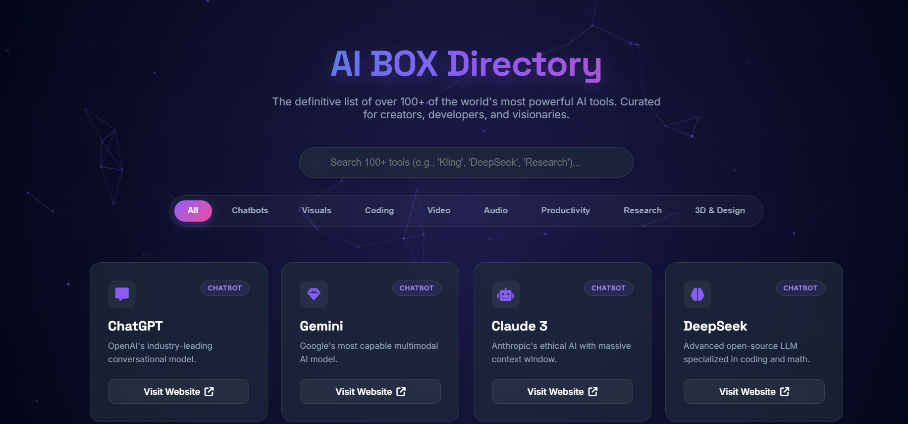

# 🧠 AI BOX


### A Curated Directory of the World’s Best AI Tools

**AI BOX** is a next-generation, curated directory featuring **100+ top Artificial Intelligence tools** across multiple domains.
It is designed with a **modern Cyberpunk UI**, glassmorphism effects, and an interactive particle background — all built using **pure HTML, CSS, and Vanilla JavaScript**.

---

## ✨ Key Features

### 🚀 Curated AI Tools

* 100+ hand-picked AI tools
* Categories include:

  * 🤖 Chatbots
  * 🎨 Image Generation
  * 💻 Coding & Development
  * 🎥 Video
  * 🎧 Audio
  * 📊 Productivity
  * 🔬 Research & Education

### 🔍 Instant Search

* Real-time search by tool name or description
* No page reload required

### ⚡ Smart Category Filtering

* One-click category filters
* Quickly explore tools by domain

### 🎨 Modern Cyberpunk UI

* Interactive **HTML5 Canvas particle background**
* **Glassmorphism** (frosted glass) cards
* Smooth hover animations
* Neon glow & futuristic color palette

### 📱 Fully Responsive

* Optimized for Desktop, Tablet, and Mobile devices

### ⚡ Lightweight & Fast

* No frameworks
* No dependencies
* Pure HTML, CSS & JavaScript

---

## 📸 Screenshots & Live Demo

> *A quick preview of AI BOX UI & experience.*

### 🖥️ Desktop View




### 🚀 Live Demo

🔗 **Live Website:** [https://AIBOX.com]()

> ⚠️ **Note:** Replace the image paths and demo link with your actual screenshots and deployed URL.

---

## 🛠️ Tech Stack

* HTML5
* CSS3
* Vanilla JavaScript
* HTML5 Canvas (Particles)

---

## 📂 Project Structure

```
ai-box-directory/
│
├── index.html      # HTML structure, CSS styles & JavaScript logic
├── README.md       # Project documentation
└── LICENSE         # MIT License
```

---

## 🚀 Installation & Usage

No build tools or setup required.

### 1️⃣ Clone the Repository

```
git clone 
```

### 2️⃣ Navigate to the Project Folder

```
cd ai-box-directory
```

### 3️⃣ Run the Project

Open `index.html` in any modern browser:

* Chrome
* Firefox
* Edge
* Safari

---

## 🤝 Contributing

Contributions are always welcome! 🚀

1. Fork the repository
2. Create a new branch

   ```
   git checkout -b feature/AmazingFeature
   ```
3. Add your tool to the `aiTools` array in `index.html`
4. Commit your changes

   ```
   git commit -m "Add AmazingFeature"
   ```
5. Push to your branch

   ```
   git push origin feature/AmazingFeature
   ```
6. Open a Pull Request

---

## 👨‍💻 Developer

**Md. Emon Hossain**
🎓 Undergraduate Student, CSE
🏫 Daffodil International University


---

## 📄 License

This project is licensed under the **MIT License**.

---

## ❤️ Acknowledgment

Built with passion for the **AI & Developer Community**.

> *Explore AI. Discover Tools. Build the Future.*
